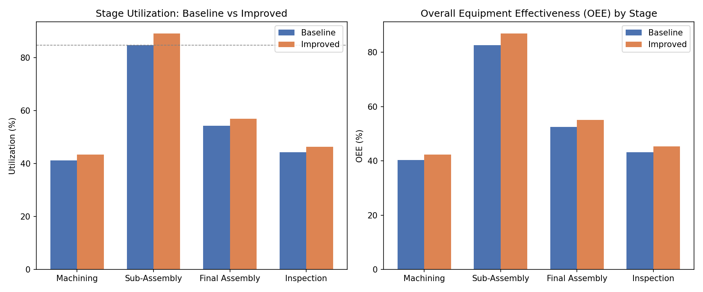
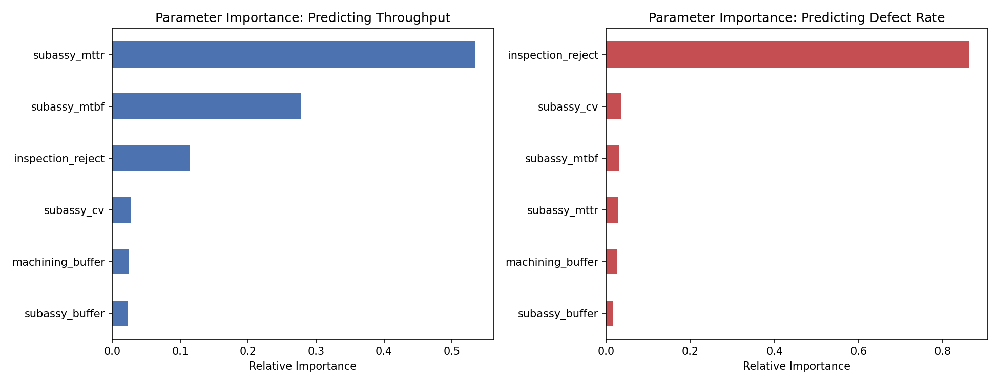

# Manufacturing Line Analysis: Bottleneck Identification & Process-Parameter Sensitivity Study

**A discrete-event simulation study of a multi-stage vehicle-component manufacturing line**

---

## 1. Problem Statement

Multi-stage manufacturing lines often have unmeasured, hidden throughput constraints: one stage
silently limits the output of the entire line while upstream and downstream stages sit idle or
blocked, waiting on it. Separately, process settings at any one stage (cycle-time variability,
repair turnaround, buffer sizing, inspection strictness) interact in non-obvious ways to determine
both how much the line produces and how much of that output is defective.

This project addresses both questions on a representative 4-stage vehicle-component line —
**Machining → Sub-Assembly → Final Assembly → Inspection**, in the spirit of prior CAD/assembly
work on a multi-component drivetrain — using two connected pieces of analysis:

1. **Bottleneck identification & intervention testing** — find the throughput-limiting stage from
   simulated operating data and quantify the gain from a targeted, low-cost fix.
2. **Process-parameter sensitivity study** — sweep the line's process parameters across many
   simulated configurations, then fit a model that *predicts* throughput and defect rate *from*
   those parameters and ranks which ones matter most.

The second piece generalizes beyond this specific line: "predict an outcome from a set of process
parameters and rank the parameters by influence" is the same analytical pattern used to relate
process settings to output quality or yield in many manufacturing and materials-processing
contexts — here it's applied to line throughput and defect rate.

## 2. Methodology

### 2.1 Simulation design
A time-stepped (1-minute resolution) discrete-event simulation was built in Python (the engine —
buffers, server states, breakdown logic — was implemented directly with `numpy`/`pandas`, without
a third-party DES library, so every mechanic is auditable). Each of the 4 stages is modeled as a
single server with:

- **Stochastic cycle time** — sampled from a Gamma distribution around a configured mean, so
  cycle times are always positive and right-skewed (matching real process-time data).
- **Finite output buffer** — models physical WIP storage space between process steps. When a
  stage finishes an item and the downstream buffer is full, the stage becomes **blocked**.
- **Breakdown process** — mean time between failures (MTBF) and mean time to repair (MTTR),
  both modeled as exponential distributions. Breakdowns are checked at the start of each new
  item (non-preemptive — an in-progress job is never interrupted mid-cycle).
- **Scrap/quality loss** — a per-stage probability that a finished item is rejected and removed
  from the line, so Quality is a genuine, measured OEE component rather than an assumed 100%.

Every stage is in exactly one state per minute: **IDLE / BUSY / BLOCKED / DOWN**. A sanity check
(state-time conservation — idle + busy + blocked + down = total simulation time, for every stage)
runs automatically after every simulation and must pass before results are reported.

### 2.2 Baseline configuration

| Stage | Mean Cycle Time (min) | Buffer Capacity | MTBF (min) | MTTR (min) | Scrap Rate |
|---|---|---|---|---|---|
| Machining | 20 | 5 | 1200 | 30 | 0% |
| Sub-Assembly  | 45 | 3 | 600  | 90 | 1% |
| Final Assembly  | 30 | 5 | 900  | 45 | 2% |
| Inspection  | 25 | 20 | 2000 | 20 | 0% |

Simulated duration: 30 days (43,200 minutes), averaged across 5 random seeds to smooth out
run-to-run variation before drawing conclusions.

## 3. Part A — Bottleneck Identification

**Method:** the bottleneck is identified as the stage with the highest utilization (busy %),
cross-checked against the blocking pattern in the upstream stage (a stage blocked for a large
share of its time is independent evidence that the *next* stage is the true constraint).

| Stage | Utilization % | Blocked % | Downtime % | Availability | Performance | Quality | OEE |
|---|---|---|---|---|---|---|---|
| Machining | 41.2% | 55.6% | 1.1% | 0.989 | 0.407 | 1.000 | **0.403** |
| **Sub-Assembly** | **84.7%** | 0.0% | 13.3% | 0.868 | 0.961 | 0.992 | **0.827** |
| Final Assembly | 54.2% | 0.0% | 2.5% | 0.975 | 0.547 | 0.984 | 0.525 |
| Inspection | 44.2% | 0.0% | 0.3% | 0.997 | 0.434 | 1.000 | 0.432 |

**Average 30-day throughput: 747.0 good units (± 18.4 across seeds).**

**Bottleneck: Sub-Assembly.** Two independent signals agree: it runs at 84.7% utilization, far
above every other stage; and Machining — immediately upstream — is blocked 55.6% of the time
because its small output buffer fills almost immediately (Machining is fast, Sub-Assembly is slow
with the longest repair time in the line). This is the textbook signature of a downstream
bottleneck starving/blocking its feeder stage. Sub-Assembly's own OEE (0.827) is the *highest* of
the four stages — it is rarely idle relative to its workload — confirming the constraint is
capacity, not poor management of that stage.

### Intervention
Two low-capex changes were applied, targeted at Sub-Assembly: MTTR reduced 30% (90→63 min,
representing faster repair turnaround) and buffer capacity increased around it (Machining's output
buffer 5→8, Sub-Assembly's own 3→6).

**Result: average 30-day throughput rose to 782.8 good units (± 14.7) — a 4.79% gain**, achieved
with zero new equipment.

## 4. Part B — Process-Parameter Sensitivity Study

**Method:** 150 line configurations were simulated, each with randomly sampled process parameters
(Sub-Assembly's cycle-time variability, MTBF, MTTR and buffer size; Machining's buffer size;
Inspection's reject rate). For each configuration, 30-day throughput and the line's overall defect
rate were recorded. A Random Forest regression model was then fit to **predict each outcome from
the process parameters**, and parameters were ranked by feature importance.

*(Note: the defect rate is computed from actual scrap events summed across stages, divided by
units entering the line — not from the difference between units entered and units finished, which
would over-count units still in transit through the line's buffers at the end of the simulation
window as if they were defective.)*

### Predicting throughput
Test R-squared = 0.715, MAE = 15.9 units.

| Parameter | Relative Importance |
|---|---|
| Sub-Assembly MTTR | 53.5% |
| Sub-Assembly MTBF | 27.8% |
| Inspection reject rate | 11.5% |
| Sub-Assembly cycle-time variability | 2.7% |
| Machining buffer size | 2.4% |
| Sub-Assembly buffer size | 2.2% |

### Predicting defect rate
Test R-squared = 0.789, MAE = 0.0051 (0.51 percentage points).

| Parameter | Relative Importance |
|---|---|
| Inspection reject rate | 86.3% |
| Sub-Assembly cycle-time variability | 3.7% |
| Sub-Assembly MTBF | 3.2% |
| Sub-Assembly MTTR | 2.8% |
| Machining buffer size | 2.5% |
| Sub-Assembly buffer size | 1.6% |

**Interpretation:** throughput is overwhelmingly governed by the bottleneck stage's reliability
(how often it fails and how long repairs take) rather than by buffer sizing or cycle-time noise —
consistent with Part A's finding. Defect rate, unsurprisingly, is governed almost entirely by the
final inspection's own reject threshold rather than upstream reliability parameters — a useful
negative result: it tells a process engineer that upstream reliability fixes will help throughput
but will not meaningfully move the defect rate, so the two problems need separate levers.

## 5. Conclusions & Recommendations

1. **Sub-Assembly is the throughput-limiting stage**, confirmed by both utilization data and the
   blocking pattern in its upstream neighbor.
2. A **30% repair-time reduction plus modest buffer resizing around the bottleneck alone yields a
   ~4.8% throughput gain** with no new equipment.
3. The **parameter sensitivity model confirms and quantifies** this: bottleneck-stage reliability
   parameters (MTTR, MTBF) account for over 80% of the variance in throughput across 150 simulated
   configurations, while buffer sizing and cycle-time variability barely matter by comparison —
   telling a process team exactly where to spend improvement effort.
4. **Defect rate is governed by a different lever entirely** (inspection threshold, 86% of
   importance) — a reminder not to expect a reliability fix to also fix quality, and vice versa.
5. Final Assembly and Inspection show low OEE despite low utilization; this is expected in a
   bottleneck-constrained line — they are starved waiting on Sub-Assembly's output, not
   inefficient in their own right. **Do not "fix" starved stages — fix the constraint feeding them.**

## 6. Methodology Validity Notes

- Every simulation run passes an automatic time-accounting sanity check (idle + busy + blocked +
  down = total simulated minutes, per stage, per run) before any result is reported.
- Part A results are averaged across 5 independent random seeds; the standard deviation is
  reported alongside every throughput figure.
- The defect-rate metric was corrected during development: an initial version inferred defects
  from (units entered minus units finished), which over-counted units still in transit through
  the line's buffers at the end of the 30-day window as if they were scrapped. The corrected
  version sums actual scrap events directly, dropping the average measured defect rate from an
  inflated ~12-17% to a realistic ~4.8%, consistent with the configured scrap probabilities.
- The model is a simplification (single line, no rework loops, non-preemptive breakdowns) —
  intended to demonstrate the analysis method on a representative flow, not to be a calibrated
  digital twin of a specific plant or process.

---
*Simulation engine: `bottleneck_simulation.py`. Sensitivity study: `sensitivity_study.py`
(scikit-learn RandomForestRegressor). Raw data: `baseline_report.csv`, `improved_report.csv`,
`sensitivity_data.csv`.*
